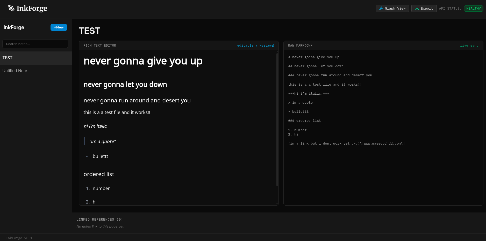
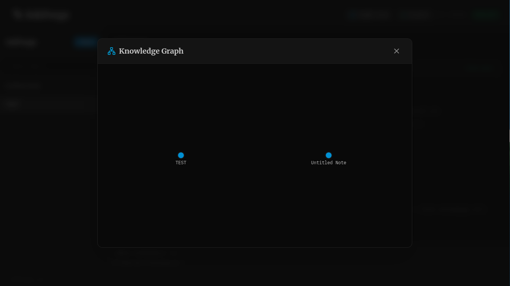
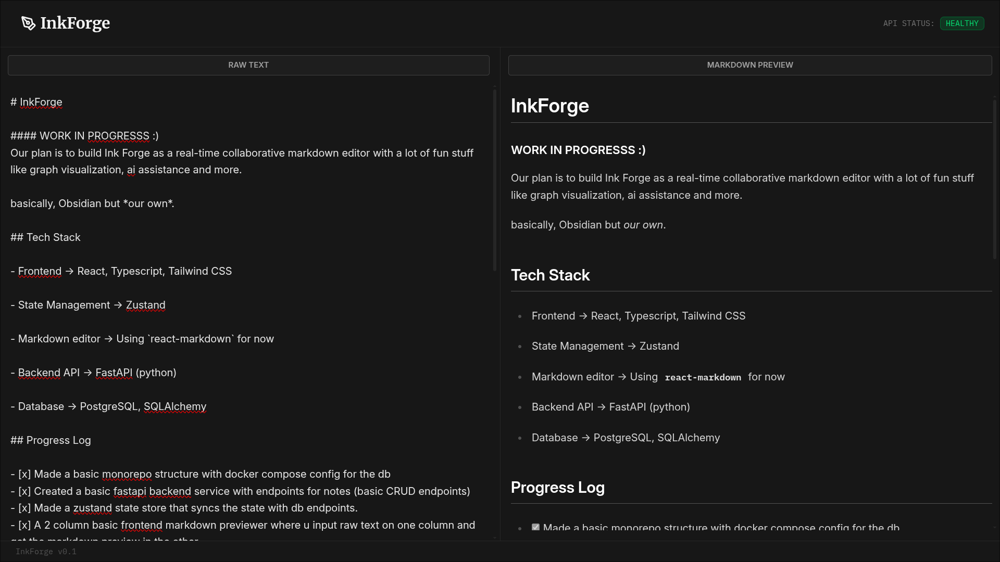

# InkForge 🖋️

#### WORK IN PROGRESSS :)
Our plan is to build Ink Forge as a real-time collaborative markdown editor with a lot of fun stuff like graph visualization, ai assistance and more.

basically, Obsidian but *our own*.

## Tech Stack

- Frontend -> React, Typescript, Tailwind CSS

- State Management -> Zustand

- Markdown editor -> Using `react-markdown` for now

- Backend API -> FastAPI (python)

- Database -> PostgreSQL, SQLAlchemy

## Progress Log

- [x] Made a basic monorepo structure with docker compose config for the db
- [x] Created a basic fastapi backend service with endpoints for notes (basic CRUD endpoints)
- [x] Made a zustand state store that syncs the state with db endpoints.
- [x] A 2 column basic frontend markdown previewer where u input raw text on one column and get the markdown preview in the other.
- [x] create new note, see all notes, delete notes
- [x] Graph visualization with link files feature

TODO: A LOT...
- [ ] Real time collaboration
- [ ] UI/UX polish to make inkforge feel more goood
- [ ] Fix the wikilinks feature, file linking doesn't work properly

## Running InkForge locally:

1. Ensure docker is running and run this command in the root dir:

```
docker compose up -d
```

2. Backend server `/apps/api`:

```bash
cd apps/api
python3 -m venv venv
source venv/bin/activate
pip install -r requirements.txt
uvicorn app.main:app --reload --port 8000

```
*(verify API docs live at http://localhost:8000/docs)*

3. Frontend client `/apps/web`:

- on a separate terminal window,run these:
```bash
cd apps/web
npm install
npm run dev
```
*(access the app live at http://localhost:5173)*


## peek peek 📸







